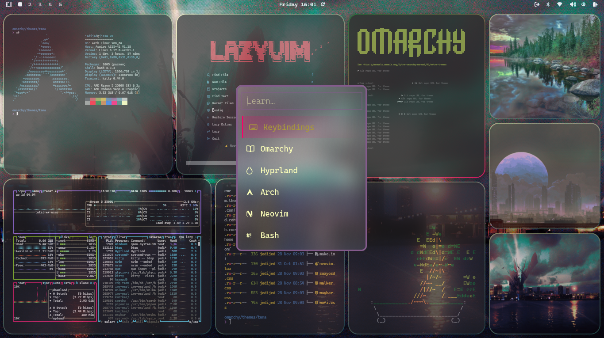

# Dimmed Monokai Theme

A collection of configuration files for a "Dimmed Monokai" theme, designed for a Linux desktop environment. The theme uses a dark background with green and pink/purple accents, and is available for a variety of applications.

## Included Configurations

*   Alacritty
*   btop
*   Chromium
*   Ghostty
*   Hyprland
*   Hyprlock
*   Kitty
*   Mako
*   Neovim
*   Swayosd
*   Walker
*   Waybar
*   Wofi

## Usage

To use this theme, you will need to copy the relevant configuration files to your system's configuration directories. For example, to use the Hyprland theme, you would copy `hyprland.conf` to `~/.config/hypr/hyprland.conf`.

### Omarchy Linux Installation

If you are using Omarchy Linux, you can install this theme via the Omarchy menu:

1.  Copy the GitHub URL of this repository.
2.  Press `Super + Alt + Space` to open the Omarchy menu.
3.  Navigate to `Install > Style > Theme`.
4.  Paste the GitHub URL when prompted.

To remove the theme:

1.  Press `Super + Alt + Space` to open the Omarchy menu.
2.  Navigate to `Remove > Style > Theme`.
3.  Select the "Dimmed Monokai" theme from the list.

Please refer to the documentation for each individual application for more information on how to apply the themes.

## License

This project is licensed under the MIT License - see the [LICENSE](LICENSE) file for details.
